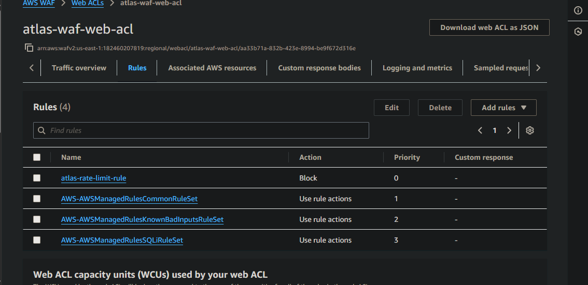
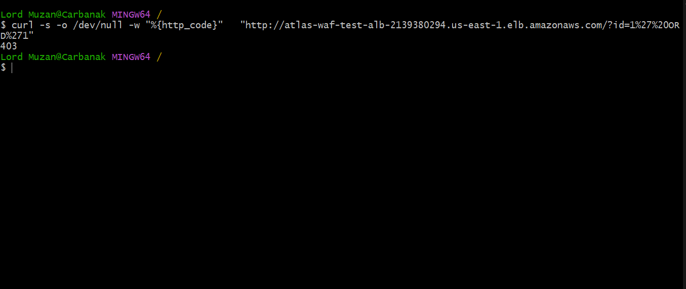
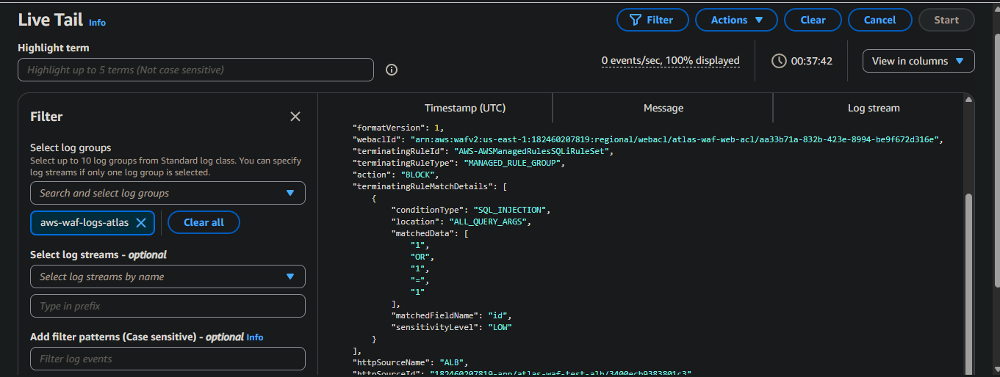
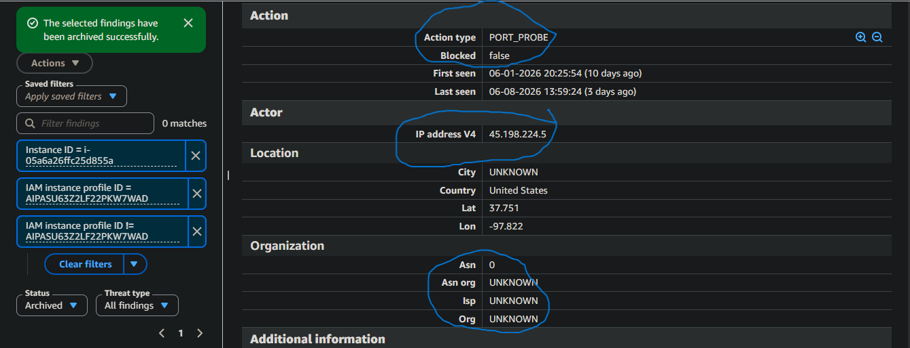
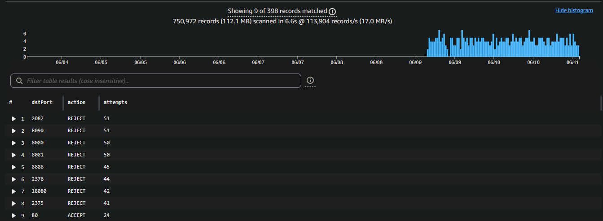

# Network-Security-WAF-Shield-VPC-Flow-Logs

> Configuring AWS WAF with managed rule sets, analysing VPC Flow Logs for threat detection, and understanding AWS Shield — with live attack evidence including a real port sweep, SQLi block, and crypto mining scanner. Built as part of a hands-on cloud security engineering roadmap.

---

## Overview

Week 10 shifts from identity-level security (Week 9) to network-level defense. Where Week 9 was about who can do what, Week 10 is about what traffic can go where — and how to detect when it shouldn't.

Within minutes of creating a public-facing Application Load Balancer, automated scanners from bulletproof hosting infrastructure found it and began probing. VPC Flow Logs captured every probe. WAF blocked every malicious request. GuardDuty correlated the network intelligence and fired a finding. This week's lab didn't simulate attacks — real threat actors provided the evidence.

---

## Architecture — Layered Network Defense

```
Internet
    ↓
AWS Shield Standard (automatic — volumetric DDoS protection)
    ↓
Application Load Balancer (atlas-waf-test-alb)
    ↓
WAF Web ACL (atlas-waf-web-acl)
├── Priority 1 — atlas-rate-limit-rule     (Block — >1000 req/5min)
├── Priority 2 — AWSManagedRulesCommonRuleSet
├── Priority 3 — AWSManagedRulesKnownBadInputsRuleSet
└── Priority 4 — AWSManagedRulesSQLiRuleSet
    ↓
EC2 Instance — web-server-week5 (i-05a6a26ffc25d855a)
    ↓
VPC Flow Logs → CloudWatch Logs (atlas-vpc-flow-logs)
```

Each layer catches what the others miss. Shield absorbs volumetric floods. WAF filters malicious HTTP at Layer 7. VPC Flow Logs record every network connection — accepted and rejected — for forensic investigation and threat detection.

---

## Services Deployed

### AWS WAF — Web Application Firewall

WAF sits in front of the Application Load Balancer and evaluates every incoming HTTP/HTTPS request against a prioritised rule set before it reaches the application. Rules are evaluated in priority order — lowest number first. The first matching rule's action applies.

**Web ACL configuration:**

| Priority | Rule | Capacity | Action |
|---|---|---|---|
| 1 | atlas-rate-limit-rule | 2 | Block — >1000 requests per 5 minutes from a single IP |
| 2 | AWSManagedRulesCommonRuleSet | 700 | OWASP Top 10 — SQLi, XSS, local/remote file inclusion |
| 3 | AWSManagedRulesKnownBadInputsRuleSet | 200 | Log4Shell, Spring4Shell, known exploit patterns |
| 4 | AWSManagedRulesSQLiRuleSet | 200 | Deep SQL injection coverage across all request components |

**Why this priority order:**

The rate-based rule sits at Priority 1 because it's the cheapest evaluation — counting requests per IP requires no pattern matching. An IP flooding the ALB gets blocked immediately before WAF spends capacity evaluating their requests against managed rule sets. More efficient mitigation and faster response to volumetric Layer 7 attacks.

**WAF logging:**

Full request logging enabled to `aws-waf-logs-atlas` CloudWatch log group. Every evaluated request — allowed and blocked — is recorded with the full HTTP request details, matched rule, action taken, and WAF labels applied.



---

### AWS Shield — DDoS Protection

Shield protects against Distributed Denial of Service attacks at Layers 3, 4, and 7. Two tiers:

**Shield Standard — Always on, always free**

Automatically enabled on every AWS account. Protects CloudFront, Route 53, ALBs, and EC2 Elastic IPs against the most common volumetric attack types — SYN/UDP floods, reflection attacks, packet fragment attacks. No configuration required. No visibility — mitigation happens silently in the background.

**The architectural implication of direct EC2 public IPs:**

web-server-week5 has a direct public IP. Shield Standard protects it from volumetric floods, but with three critical limitations:

- No Layer 7 DDoS detection — HTTP floods targeting the application are invisible to Standard
- No attack visibility — you have no metrics, no logs, no indication that mitigation is occurring
- No WAF integration — WAF cannot attach directly to EC2, only to ALB/CloudFront/API Gateway

Placing an ALB in front of EC2 moves the instance into a private subnet with no public IP. The attack surface reduces to the ALB's IP only. WAF protection becomes possible. Shield Advanced's enhanced detection and DRT access become available. This is the production-grade architecture.

**Shield Standard vs Shield Advanced:**

| | Standard | Advanced |
|---|---|---|
| Cost | Free — automatic | $3,000/month + 12-month commitment |
| Attack types | Layers 3/4 volumetric | Layers 3, 4, and 7 |
| Visibility | None | Real-time CloudWatch metrics |
| DDoS Response Team | No | 24/7 access during active attacks |
| WAF integration | No | Automatic rule deployment during attacks |
| Cost protection | No | Service credits for DDoS-induced scaling costs |

---

### VPC Flow Logs — Network Visibility

VPC Flow Logs capture metadata about every IP connection flowing through the VPC — source IP, destination IP, source port, destination port, protocol, bytes transferred, packets, start/end timestamps, and whether the traffic was accepted or rejected by security groups and NACLs.

**What Flow Logs capture vs what they miss:**

```
Captured:
✅ All TCP/UDP/ICMP connections — accepted and rejected
✅ Inter-instance traffic within the VPC
✅ Traffic between VPC and internet
✅ Traffic to/from VPC endpoints

Not captured:
❌ Instance Metadata Service (169.254.169.254) — link-local, never VPC traffic
❌ DNS queries to Route 53 Resolver
❌ Windows license activation traffic
```

The IMDS blind spot connects directly to Week 9 — credential theft from the instance metadata service generates no VPC Flow Log entry for the same reason it generates no CloudTrail entry. Both logging systems are blind to link-local traffic. This is why PassRole restrictions and IMDSv2 enforcement are required as compensating controls — logging alone cannot detect IMDS credential theft.

**Flow logs enabled on:** Default VPC — all traffic — 1-minute aggregation interval — delivered to `atlas-vpc-flow-logs` CloudWatch log group.

**Sample flow log record — decoded:**

```
7              → Flow log format version
REDACTED       → AWS account ID
eni-0f37bf94924d3ad20 → Network interface ID (web-server-week5 ENI)
45.198.224.5   → Source IP — external attacker
172.31.70.222  → Destination IP — web-server-week5 private IP
8080           → Destination port — targeted port
RANDOM         → Source port — attacker ephemeral port
6              → Protocol — TCP
40             → Bytes — SYN packet only (no handshake completed)
REJECT         → Action — security group blocked the connection
OK             → Log status — record captured successfully
```

---

## Live Evidence — Real Attacks Captured

### Finding 1 — SQL Injection Blocked by WAF

A SQL injection payload was sent to the ALB to verify WAF detection:

```bash
curl -s -o /dev/null -w "%{http_code}" \
  "http://atlas-waf-test-alb-2139380294.us-east-1.elb.amazonaws.com/?id=1%27%20OR%20%271%27%3D%271"
```

**Result: 403 — Blocked**

WAF decomposed the URL-encoded payload `1' OR '1'='1` and matched it against the `SQLi_QUERYARGUMENTS` rule in `AWSManagedRulesSQLiRuleSet`. The full CloudWatch log entry confirms:

```json
"terminatingRuleId": "AWS-AWSManagedRulesSQLiRuleSet",
"action": "BLOCK",
"conditionType": "SQL_INJECTION",
"location": "ALL_QUERY_ARGS",
"matchedData": ["1", "OR", "1", "=", "1"],
"matchedFieldName": "id",
"sensitivityLevel": "LOW"
```

The WAF log doesn't just confirm a block — it shows the decomposed logical components of the attack, the specific field targeted, and the label applied for downstream rule chaining.





---

### Finding 2 — Automated Scanner Discovered Within Minutes of ALB Creation

Within minutes of the ALB becoming publicly reachable, an automated scanner from `45.198.224.5` — listed on the ProofPoint threat intelligence feed — began probing multiple instances in the VPC. The scanner was detected via two independent mechanisms:

**GuardDuty:** Generated finding `Recon:EC2/PortProbeUnprotectedPort` against web-server-week5 (`i-05a6a26ffc25d855a`). 185 probe attempts recorded over 7 days (June 1–8, 2026). Finding sourced from VPC Flow Logs — confirming the Flow Logs → GuardDuty detection pipeline.

**VPC Flow Logs:** Revealed the complete port sweep scope that GuardDuty's finding only partially captured.

**Full port sweep analysis from VPC Flow Logs:**

```
fields @timestamp, srcAddr, dstAddr, dstPort, action, bytes
| filter srcAddr = "45.198.224.5"
| stats count(*) as attempts by dstPort, action
| sort attempts desc
```

| Port | Service | Attempts | Action | Threat Intelligence |
|---|---|---|---|---|
| 2087 | WHM/cPanel admin panel | 51 | REJECT | Server management takeover |
| 8090 | HTTP alternate | 51 | REJECT | Web service discovery |
| 8080 | HTTP alternate | 50 | REJECT | Was Chisel test port — actively targeted |
| 8081 | HTTP alternate | 50 | REJECT | Web service discovery |
| 8888 | Jupyter Notebook | 45 | REJECT | Code execution — unauthenticated RCE |
| 2376 | Docker TLS API | 44 | REJECT | Container infrastructure takeover |
| 18080 | Monero RPC | 42 | REJECT | Crypto mining infrastructure hijack |
| 2375 | Docker unencrypted API | 41 | REJECT | Container infrastructure takeover |
| 80 | HTTP | 24 | ACCEPT | Apache confirmed open — expected |

**Port 18080 is the critical indicator.** This is the default Monero cryptocurrency RPC port. The scanner is explicitly hunting for exposed crypto mining infrastructure — the same threat class as `CryptoCurrency:EC2/BitcoinTool.B` in GuardDuty's finding catalogue. Combined with Docker ports 2375 and 2376, this is a targeted sweep for container and crypto mining resources to hijack — not a generic web scanner.

**Port 8888** confirms opportunistic code execution targeting — an exposed Jupyter Notebook provides a browser-based Python execution environment with no authentication by default.

All probes rejected correctly by the security group. Only port 80 accepted — Apache serving HTTP as expected. No exploitation occurred.





---

### Finding 3 — Russian IP Scanner Logged by WAF

Within minutes of WAF logging being enabled, an additional scanner from `5.101.64.7` (Russia) hit the ALB DNS name directly. The WAF log entry reveals the scanner was targeting the ALB's underlying IP address (`44.217.128.118`) rather than the DNS hostname — indicating an IP-based sweep rather than a targeted DNS-based attack.

```json
"action": "ALLOW",
"clientIp": "5.101.64.7",
"country": "RU",
"uri": "/",
"terminatingRuleId": "Default_Action"
```

Clean GET request — no malicious payload — correctly allowed by WAF's default action. The scanner confirmed the web server is reachable but sent no exploitable content.

**The insight:** Internet-facing infrastructure is found and probed within minutes of creation — not hours, not days. Automated scanners sweep the entire IPv4 space continuously. Security controls must be in place before deployment, not added reactively.

---

## CloudTrail vs VPC Flow Logs vs GuardDuty — The Complete Visibility Model

This week demonstrates all three working together in a real incident:

```
WHAT HAPPENED                    WHO SAW IT
─────────────────────────────────────────────────────
Port 8080 opened on EC2          Nobody — no API call
Port 8080 probed 185 times       VPC Flow Logs ✅
                                 GuardDuty (via Flow Logs) ✅
                                 CloudTrail ❌ (no API call)

SQLi sent to ALB                 WAF ✅ (blocked + logged)
                                 CloudTrail ❌ (no AWS API call)
                                 VPC Flow Logs ✅ (network level)
                                 GuardDuty ❌ (no threat pattern match)

Port 8080 SG rule revoked        CloudTrail ✅ (API call: RevokeSecurityGroupIngress)
                                 VPC Flow Logs ❌ (config change, not traffic)
                                 GuardDuty ❌ (not a threat event)
```

No single service provides complete visibility. CloudTrail sees configuration changes. VPC Flow Logs see network traffic. WAF sees HTTP request content. GuardDuty correlates all sources and fires findings. Each fills a gap the others leave.

---

## Key Conceptual Anchors

- WAF priority order matters — cheapest rules first. Rate limiting before pattern matching is both more efficient and faster mitigation
- VPC Flow Logs capture metadata only — no packet content. 40 bytes on a port probe = TCP SYN only, handshake never completed
- Port 18080 on a scanner = crypto mining targeting. Port 8888 = Jupyter Notebook targeting. Know what the ports mean
- Direct EC2 public IPs limit WAF protection — WAF only attaches to ALB, CloudFront, and API Gateway. Private subnets behind ALB is the correct production architecture
- Shield Standard protects EC2 Elastic IPs automatically — but silently, with no visibility, and only against volumetric attacks
- IMDS credential theft is invisible to both CloudTrail and VPC Flow Logs — link-local traffic never reaches either logging system
- Internet-facing infrastructure is found within minutes — security controls must be deployed before exposure, not added reactively

---

## AWS Services Used

- **AWS WAF** — Layer 7 web application firewall with managed rule sets and rate-based rules
- **AWS Shield Standard** — Automatic volumetric DDoS protection
- **Amazon VPC Flow Logs** — Network traffic metadata logging
- **Amazon CloudWatch Logs** — Log ingestion, Log Insights queries, WAF log storage
- **Amazon GuardDuty** — Threat detection via VPC Flow Logs analysis
- **Elastic Load Balancing (ALB)** — Application Load Balancer as WAF attachment point

---

## Part of the AWS Cloud Security Roadmap

This project is Week 10 of a structured 6-month AWS Cloud Security Engineering program.

| Week | Topic | Deliverable |
|---|---|---|
| 1 | Cloud Foundations, Shared Responsibility | [Cloud-Foundations-Shared-Responsibility-Model](https://github.com/Atlas-Ghostshell/Cloud-Foundations-Shared-Responsibility-Model) |
| 2 | VPC & Networking | [VPC-Networking-Fundamentals](https://github.com/Atlas-Ghostshell/VPC-Networking-Fundamentals) |
| 3 | IAM Deep Dive | [IAM-Least-Privilege-S3-Access-Control](https://github.com/Atlas-Ghostshell/IAM-Least-Privilege-S3-Access-Control) |
| 4 | Cloud Storage & S3 | [S3-Static-Website-Versioning-Data-Protection](https://github.com/Atlas-Ghostshell/S3-Static-Website-Versioning-Data-Protection) |
| 5 | EC2 Hardening & IMDSv2 | [Hardened-EC2-Web-Server](https://github.com/Atlas-Ghostshell/Hardened-EC2-Web-Server) |
| 6 | VPC Deep Dive — 3-Tier Architecture | [Secure-3-Tier-VPC-Architecture](https://github.com/Atlas-Ghostshell/Secure-3-Tier-VPC-Architecture) |
| 7 | CloudTrail, CloudWatch, Root Detection | [CloudTrail-CloudWatch-Root-Detection](https://github.com/Atlas-Ghostshell/CloudTrail-CloudWatch-Root-Detection) |
| 8 | GuardDuty, Security Hub, Inspector | [GuardDuty-SecurityHub-Inspector-ThreatDetection](https://github.com/Atlas-Ghostshell/GuardDuty-SecurityHub-Inspector-ThreatDetection) |
| 9 | IAM Privilege Escalation Lab | [IAM-Privilege-Escalation-Lab](https://github.com/Atlas-Ghostshell/IAM-Privilege-Escalation-Lab) |
| **10** | **Network Security — WAF, Shield, VPC Flow Logs** | **This repository** |
| 11 | Data Protection — KMS, S3 Audit, Macie | Coming soon |

---

*Geoffrey Muriuki Mwangi · [GitHub: Atlas-Ghostshell](https://github.com/Atlas-Ghostshell) · [LinkedIn](https://linkedin.com/in/geoffrey-muriuki-b4ba71306)*
